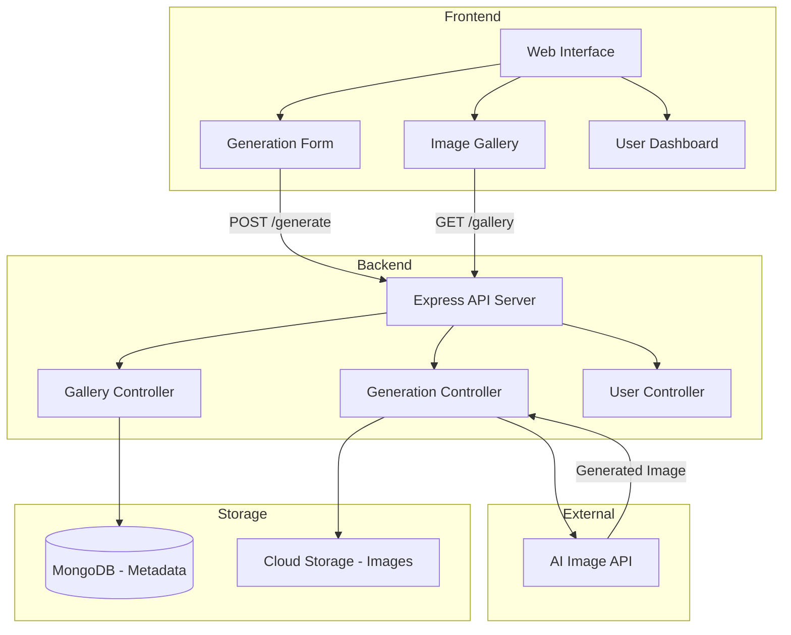

<


</div>

---

## 🎯 Problem & Motivation

AI image generation has exploded in popularity, but most tools are either:
- **Closed platforms** with limited sharing capabilities
- **CLI-only tools** that lack a user-friendly interface
- **Individual use only** with no community aspect

**Img-Gen AI** combines the power of AI image generation with a **community-driven platform** where users can:
- Generate unique images from text descriptions
- Browse and discover creations from other users
- Share their best generations with the community
- Get inspired by other people's creative prompts

---

## ✨ Key Features

| Feature | Description |
|---|---|
| 🖼️ **Text-to-Image Generation** | Describe your vision in words, get stunning AI-generated images |
| 🌐 **Community Gallery** | Browse, discover, and get inspired by others' creations |
| 📤 **Share & Showcase** | Publish your generated images with prompts for others to see |
| 🔍 **Search & Filter** | Find specific styles, themes, or prompts in the gallery |
| 🐳 **Docker Deployment** | Containerized for easy one-command deployment |
| 📱 **Responsive Design** | Beautiful UI across desktop, tablet, and mobile |

---

## 🏗️ Architecture



---

## 🛠️ Tech Stack

| Layer | Technology |
|---|---|
| **Frontend** | HTML5, CSS3, JavaScript |
| **Backend** | Node.js, Express.js |
| **Database** | MongoDB |
| **AI Engine** | AI Image Generation API |
| **Containerization** | Docker, Docker Compose |
| **Styling** | Custom CSS with responsive design |

---

## 🚀 Getting Started

### Prerequisites

- [Node.js](https://nodejs.org/) v16+
- [MongoDB](https://www.mongodb.com/) (local or Atlas)
- AI Image Generation API key
- [Docker](https://www.docker.com/) (optional)

### Local Development

```bash
# Clone the repository
git clone https://github.com/Kushagra-Dobriyal/Img-Gen_AI.git
cd Img-Gen_AI

# Install dependencies
npm install

# Configure environment
cp .env.example .env
# Edit .env with your API keys and MongoDB URI

# Start the server
npm run dev
```

### Docker Deployment

```bash
# Build and run
docker-compose up --build

# App available at http://localhost:3000
```

---

## 📁 Project Structure

```
Img-Gen_AI/
├── src/
│   ├── index.js             # App entry point
│   ├── config/
│   │   └── db.js            # Database configuration
│   ├── controllers/
│   │   ├── generate.js      # Image generation logic
│   │   ├── gallery.js       # Community gallery
│   │   └── user.js          # User management
│   ├── models/
│   │   ├── Image.js         # Generated image schema
│   │   └── User.js          # User schema
│   ├── routes/
│   │   ├── generate.routes.js
│   │   ├── gallery.routes.js
│   │   └── user.routes.js
│   └── middleware/
│       └── auth.js          # Authentication middleware
├── public/
│   ├── css/                 # Stylesheets
│   ├── js/                  # Client-side JavaScript
│   └── index.html           # Main page
├── Dockerfile
├── docker-compose.yml
├── package.json
└── README.md
```

---

## 🔄 API Endpoints

| Method | Endpoint | Description |
|---|---|---|
| `POST` | `/api/generate` | Generate an image from a text prompt |
| `GET` | `/api/gallery` | Browse community-shared images |
| `GET` | `/api/gallery/:id` | Get a specific image and its details |
| `POST` | `/api/gallery/share` | Share a generated image to the community |
| `GET` | `/api/gallery/search?q=` | Search images by prompt or tags |

### Example: Generate an Image

```http
POST /api/generate
Content-Type: application/json

{
  "prompt": "A futuristic city at sunset with flying cars",
  "style": "digital-art"
}
```

**Response:**
```json
{
  "id": "img_xyz789",
  "imageUrl": "https://...",
  "prompt": "A futuristic city at sunset with flying cars",
  "createdAt": "2025-03-25T10:30:00Z"
}
```

---

## 🤝 Contributing

Contributions are welcome! Please feel free to submit a Pull Request.

1. Fork the repository
2. Create your feature branch (`git checkout -b feature/amazing-feature`)
3. Commit your changes (`git commit -m 'Add amazing feature'`)
4. Push to the branch (`git push origin feature/amazing-feature`)
5. Open a Pull Request

---

## 📝 License

This project is open source and available under the [MIT License](LICENSE).

---

<div align="center">

**Built with ❤️ by [Kushagra Dobriyal](https://github.com/Kushagra-Dobriyal)**

</div>
]]>
